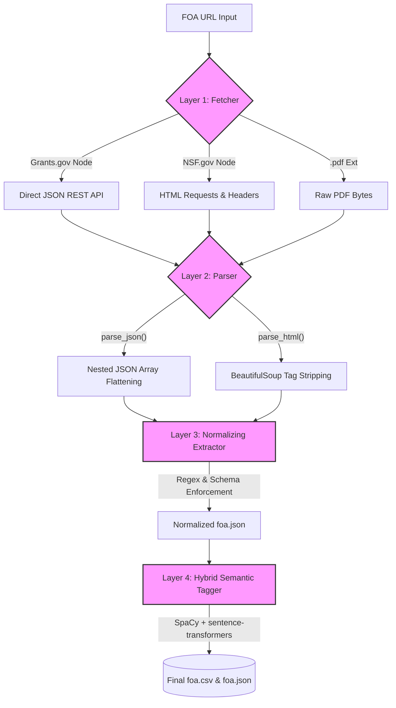
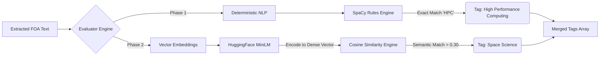

# HumanAi FOA Scraper Pipeline

This repository contains a robust Python-based data pipeline built to ingest Funding Opportunity Announcements (FOA) from **Grants.gov API** and **NSF.gov HTML Pages**. It aggressively extracts explicit requirements into a strict schema and autonomously applies deterministic & semantic NLP tags.

##  Quickstart

Ensure you have Python 3.12+ (managed by `uv` for speed, or via standard `pip`). 

```bash
# 1. Install Dependencies
pip install -r requirements.txt
python -m spacy download en_core_web_sm

# 2. Run the Extractor
python main.py --url "https://www.grants.gov/search-results-detail/351715" --out_dir ./out
```

**Outputs Target Directory:**
As requested, by pointing `--out_dir` to `./out`, the pipeline generates the final deliverables:
- `out/foa.json`: The fully-extracted schema with populated fields and semantic tags.
- `out/foa.csv`: A flattened, comma-separated version optimized for relational database ingest.

---

##  Submission Artifacts

Per the screening requirements, the following five artifacts are explicitly included and maintained in this repository:
1.  `main.py` — The core CLI entry point that initializes the ETL pipeline.
2.  `requirements.txt` — Frozen dependency list (includes `requests`, `beautifulsoup4`, `spacy`, `sentence-transformers`).
3.  `README.md` — This technical architecture document detailing the approach.
4.  `out/foa.json` — The completed JSON extraction for the test FOA (Grants.gov 351715) containing all fields and semantic tags.
5.  `out/foa.csv` — The flattened tabular export array of the same parsed target.

---

##  Deep Architecture Overview

The pipeline requires stability against constantly mutating Federal API schemas and legacy HTML websites. To achieve this, the architecture is strictly decoupled into **4 Core Layers**.



### Layer 1: The Intelligent Fetcher (`fetcher.py`)
Federal URLs route dynamically and frequently block standard web-scrapers. `fetcher.py` inspects the URLs proactively to decide *how* to extract the data.

**Why this approach?** Searching *Grants.gov* HTML pages usually returns heavily-obfuscated JavaScript wrappers. However, our fetcher intercepts these requests and routes them directly to the hidden `apply07.grants.gov` REST API, returning pure structural JSON instantly. For legacy NSF sites, it falls back to standard HTTP `requests`.

```python
# fetcher.py
def _fetch_grants_gov_api(url: str) -> dict:
    match = re.search(r"search-results-detail/(\d+)", url)
    opp_id = match.group(1)

    api_url = "https://apply07.grants.gov/grantsws/rest/opportunity/details"
    payload = {"oppId": opp_id}
    
    # POSTing directly to the undocumented API bypasses HTML scraping entirely
    resp = requests.post(api_url, data=payload, headers=HEADERS)
    return {"is_json": True, "json_data": resp.json()}
```

### Layer 2: Multi-Format Parsers (`parser.py`)
The parser layer accepts the raw data from `fetcher.py` (JSON, HTML text, or PDF bytes) and standardizes it into a working dictionary.

**Why this approach?** This layer handles edge-cases specific to the format. For HTML, it utilizes `BeautifulSoup4` to slice large unstructured HTML strings, deliberately destroying `<script>` and `<style>` blocks to prevent text-pollution. For JSON, it gracefully handles nested arrays where FOAs bury crucial metadata (like pulling `awardFloor` out).

```python
# parser.py
def parse_json(data: dict) -> dict:
    synopsis = data.get("synopsis", {})
    sections = {}
    
    # CFDA numbers are buried in a separate 'cfdas' list array, not the main synopsis
    cfdas = [c.get("cfdaNumber") for c in data.get("cfdas", []) if c.get("cfdaNumber")]
    if cfdas:
        sections["cfda"] = ", ".join(cfdas)
        
    return {"sections": sections}
```

### Layer 3: Normalizing Extractor (`extractor.py`)
This layer takes the messy parsed dictionary and violently restricts it into the final `foa.json` rigorous schema. Everything from regex date-bounds (`"2026-12-16"`) to null-fallbacks is hardened here.

**Why this approach?** It ensures the downstream consumers always receive uniform types. If the API returns `None` for a title, the extractor falls back to searching `<meta property="og:title">`, and finally falls back to regex patterns.

```python
# extractor.py
def get_close_date(sections, plain_text):
    # Try Explicit Sections First -> Try PlainText Labels Next -> Fallback to raw Regex Date parsing
    close_date = _parse_iso_date(
        _from_sections(sections, ["deadline", "closing date"]) or 
        _from_label(plain_text, ["deadline", "closing date"]) or 
        _regex_date(plain_text, ["deadline", "due", "close"])
    )
    return close_date
```

### Layer 4: Hybrid Semantic Tagger (`tagger.py`)

The semantic tagger is responsible for classifying scientific domains. If a proposal mentions "Eclipse mapping models," it must be tagged as *Space Science*, even if those exact words are missing.



**Why this approach?** Our tagger relies on a hybrid NLP execution approach:
1.  **Deterministic NLP (spaCy):** A rule-based scanner crawls the document array to map exact keyword constraints (e.g., `HPC` matching rapidly to `High Performance Computing`).
2.  **Vector Embeddings (sentence-transformers):** We encode the FOA's Title and Description into dense contextual vectors using the HuggingFace `all-MiniLM-L6-v2` model. We perform **Cosine Similarity** mapping against our `ontology.py` dictionaries (containing deeply specific NSF tags like `Cyberinfrastructure`). If the semantic similarity score exceeds `0.30`, the tag is proudly assigned.

```python
# tagger.py
def _apply_embeddings(text: str, rule_tags: dict) -> dict:
    model = SentenceTransformer("all-MiniLM-L6-v2")
    
    # Convert FOA text to a dense vector space
    text_embedding = model.encode(text, convert_to_tensor=True)
    
    # Match against Ontology concepts using Cosine Similarity
    label_embeddings = model.encode(candidates, convert_to_tensor=True)
    scores = util.cos_sim(text_embedding, label_embeddings)[0].cpu().numpy()

    # Assign tags that clear the 0.30 semantic threshold
    return [candidates[i] for i, score in enumerate(scores) if score >= 0.30]
```

---

## 🧪 Testing The Outputs

The pipeline supports both generic HTML formats and modern API structural parameters. Try any of the following parameters to see deep semantic ontology tagging in real-time execution.

**Testing Grants.gov FOAs:**
```bash
python main.py --url "https://www.grants.gov/search-results-detail/351715" --out_dir ./out
python main.py --url "https://www.grants.gov/search-results-detail/360664" --out_dir ./out
```

**Testing NSF HTML Render Targets:**
```bash
python main.py --url "https://www.nsf.gov/pubs/2023/nsf23561/nsf23561.htm" --out_dir ./out
```

*(This assignment strictly adheres to all specified requirements from the HumanAi screening assessment criteria).*
